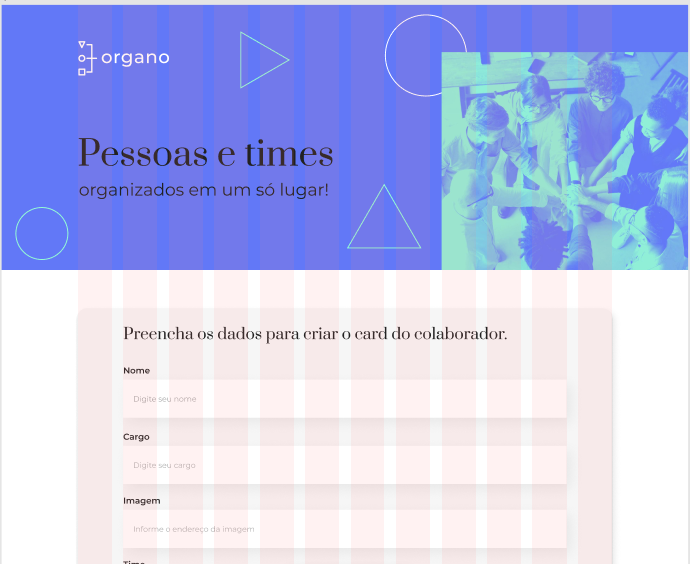
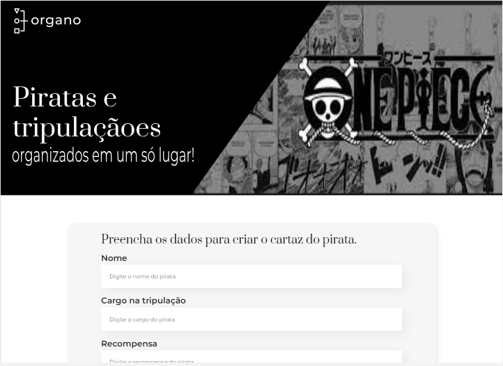

  
# Organo

O organo se propõe é ser uma aplicação para organizar equipes, grupos, clube e etc... No meu caso eu decidi fazer um para 
organizar tripulações piratas do meu anime favorito, que é One Piece.

| :placard: Vitrine.Dev |  [Minha Vitrine Dev](https://cursos.alura.com.br/vitrinedev/marioapereirar)   |
| -------------  | --- |
| :sparkles: Nome        | **Organo**
| :label: Tecnologias |   
| 🎇: Bibliotecas | [React](https://react.dev/).
| :rocket: URL         | [Projeto](https://organo-nine-mu.vercel.app/)
| :fire: Curso    | [Conheça o curso na Alura](https://cursos.alura.com.br/course/react-desenvolvendo-javascript)
  

# 💪 Sobre o curso da Alura

O curso [React: desenvolvendo com JavaScript](https://cursos.alura.com.br/course/react-desenvolvendo-javascript) é um curso para iniciantes no React, acho que seria uma boa primeira
experiência para qualquer um. E as aulas em dívidas em módulos que ensinavam desde de como instalar a framework do React
na sua máquina até como por funções e dinâmica nos componentes da página web. E as aulas foram instruídas pelo [Vinícios Neves](https://www.linkedin.com/in/vinny-neves/) com o auxílio do [Paulo Silveira](https://www.linkedin.com/in/paulosilveira/).
## Objetivo

O objetivo era criar uma aplicação que primeiro teria um formulário de cadastro de colaborador, membros ou no meu caso de
piratas, e a partir das informações cadastradas criar um card do membro em questão. A segunda parte foi criar as seções
onde seriam exibidos estes cards, cada uma com sua cor para diferenciar os grupos ou equipes.
E por fim foi feita a parte de renderizar o card na tela e separar ele na seção correta a qual equipe ele pertencia.

# 🤯 Minha experiência

Essa foi a minha primeira experiência estudando e lidando com React, e para uma primeira vez eu achei bem tranquila. Tive
certas dificuldades em relação principalmente a parte passar uma informação para o componente usando as props, mas nada
que me deixasse travado por muito tempo no mesmo lugar. Eu tive uma experiência bem agradável, e espero continuar
estudando e lidando bastante com o React.
## ⭐ Representação do projeto

<h2>Versão Original</h2>

<h2>Minha versão</h2>

# 🙋‍♂️ Autor

[Mário Anthony Pereira Rocha](https://portfolio-rust-delta-33.vercel.app/)

